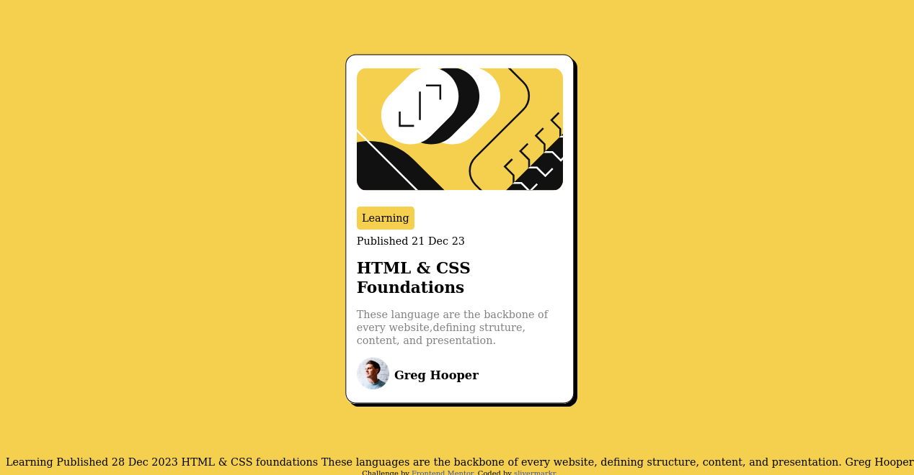
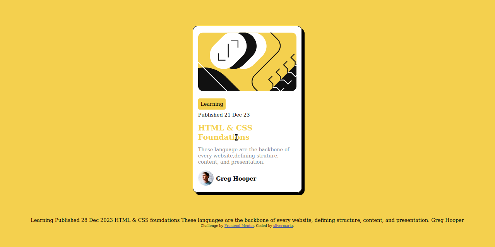

# Frontend Mentor - Blog preview card solution

This is a solution to the [Blog preview card challenge on Frontend Mentor](https://www.frontendmentor.io/challenges/blog-preview-card-ckPaj01IcS). Frontend Mentor challenges help you improve your coding skills by building realistic projects. 

## Table of contents

- [Overview](#overview)
  - [The challenge](#the-challenge)
  - [Screenshot](#screenshot)
  - [Links](#links)
- [My process](#my-process)
  - [Built with](#built-with)
  - [What I learned](#what-i-learned)
  - [Continued development](#continued-development)
  - [Useful resources](#useful-resources)
- [Author](#author)
- [Acknowledgments](#acknowledgments)

**Note: Delete this note and update the table of contents based on what sections you keep.**

## Overview

### The challenge

Users should be able to:

- See hover and focus states for all interactive elements on the page

### Screenshot

### Links

- Solution URL: [Add solution URL here](https://your-solution-url.com)
- Live Site URL: [Add live site URL here](https://your-live-site-url.com)

## My process

### Built with

-Layed out the HTML
-Used external CSS to style_

**Note: These are just examples. Delete this note and replace the list above with your own choices**

### What I learned

I discovered how cool hover is!
I use the browser Devtool to make initial changes

### Continued development

I'm looking forward to creating a similar project but maybe more cards like the tinder swipe UI thing where there are number of cards and you can swipe them left and right. 

**Note: Delete this note and the content within this section and replace with your own plans for continued development.**

### Useful resources

## Author

- Github - [https://github.com/slivermarkr](https://www.your-site.com)
- Frontend Mentor - [https://www.frontendmentor.io/profile/slivermarkr](https://www.frontendmentor.io/profile/yourusername)
**Note: Delete this note and add/remove/edit lines above based on what links you'd like to share.**

## Acknowledgments

Thanks to Google DevTools and ChatGPT for helping me complete this project
**Note: Delete this note and edit this section's content as necessary. If you completed this challenge by yourself, feel free to delete this section entirely.**
